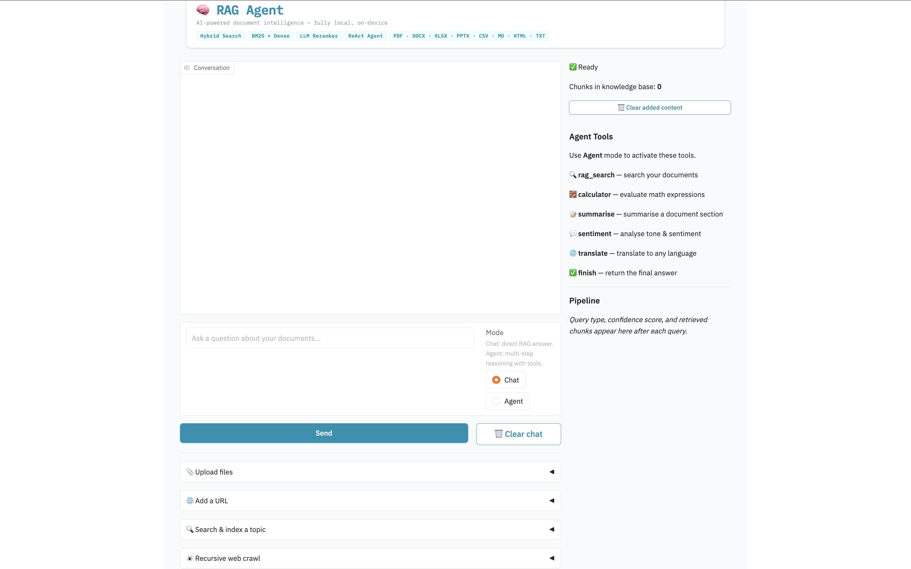
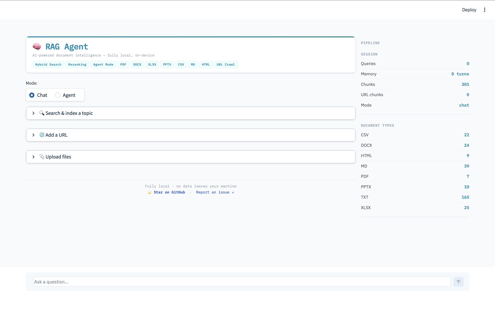
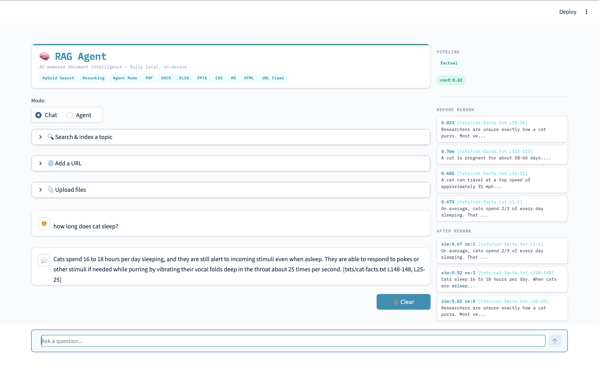
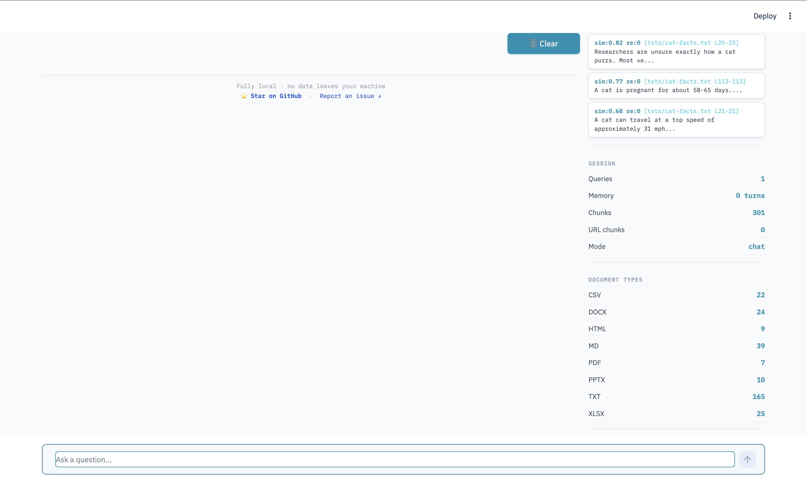

# 知阅 · 个人文献阅读器

> 课程二创项目：基于 Anjana Tiha 的开源项目 **RAG Agent** 改造，保留原项目的
> Apache 2.0 许可证与作者署名。原始项目地址：
> [Retrieval-Augmented-Generation-RAG-Agent](https://github.com/anjanatiha/Retrieval-Augmented-Generation-RAG-Agent)。

知阅面向个人文献阅读场景，支持导入 **PDF、Word（DOCX）和网页链接**，并在本机完成
正文解析、原文阅读与个人阅读记录管理。

## 本次二创新增

- 全中文、低装饰的简约阅读界面，项目重命名为“知阅”
- SQLite 个人文献库：标题、作者、标签、未读/阅读中/已读状态
- 统一的 PDF、DOCX、网页链接导入入口与重复内容检测
- 宽屏原文阅读；PDF 支持文本阅读与原版切换，Word/网页显示清洗正文
- 鼠标划选高亮、撤销上一次高亮和全部清除
- 本地持久化的收藏、个人笔记和 0–100% 阅读进度
- 删除文献时同步清理个人文献库与原文件
- 修复原项目在空 `docs/` 目录首次启动时直接退出的问题

个人文件保存在 `docs/`，阅读数据保存在 `data/literature_library.db`；这两个目录均已加入
`.gitignore`，不会被意外提交到仓库。

## Windows 快速运行

需要 Python 3.11。在项目目录执行：

```powershell
py -3.11 -m venv .venv
.\.venv\Scripts\Activate.ps1
pip install -r requirements.txt
streamlit run app.py
```

浏览器打开 `http://localhost:8501`。当前二创版本不启用 AI、Ollama 或向量检索。

完整修改记录见 [MODIFICATIONS.md](MODIFICATIONS.md)。下方保留原项目说明，便于追溯技术来源。

---

## 原项目：RAG Agent

*Built by [Anjana Tiha](https://github.com/anjanatiha) — [LinkedIn](https://www.linkedin.com/in/anjanatiha/) · [Medium](https://medium.com/@anjanatiha/rag-58d2497529d0)*

[](https://www.python.org/downloads/release/python-3110/)
[](https://github.com/anjanatiha/Retrieval-Augmented-Generation-RAG-Agent/releases)
[](https://github.com/anjanatiha/Retrieval-Augmented-Generation-RAG-Agent/actions/workflows/test.yml)
[](https://huggingface.co/spaces/anjanatiha2024/Rag-Agent)
[](LICENSE)
[](https://ollama.com)
[](https://www.trychroma.com)
[](https://streamlit.io)
[](README.md)
[](docker-compose.yml)

A fully local, production-grade Retrieval-Augmented Generation system. Upload documents, ask questions in plain English, and get accurate answers with source citations — no cloud, no API keys, no data leaving your machine.

Supports PDF, Word, Excel, Legacy Excel (XLS), PowerPoint, CSV, Markdown, HTML, and plain text — 9 formats total.

---

## Quick Start

| | Option | Time |
|-|--------|------|
| **[► Try the live demo](https://huggingface.co/spaces/anjanatiha2024/Rag-Agent)** | Open in browser, upload a file, ask a question — nothing to install | 30 seconds |
| **[► Install locally](#installation)** | Run on your own machine with full privacy | ~10 minutes |
| **[► Read the blog post](https://medium.com/@anjanatiha/rag-58d2497529d0)** | Architecture, benchmarks, and lessons learned — published on Medium | 6 min read |

[](https://huggingface.co/spaces/anjanatiha2024/Rag-Agent)

---

## Features

- **Chat with your documents** — ask questions about PDFs, Word docs, spreadsheets, presentations, CSV, Markdown, or HTML files
- **Structured data support** — accurately retrieves from tables, spreadsheets, and resumes where most RAG systems fail
- **Agent mode** — autonomous ReAct agent with 6 tools: search, calculator, summarise, sentiment, translate, and finish
- **Streaming responses** — tokens appear word by word as they generate; no waiting for the full answer
- **Multiple ingestion methods** — drop files into a folder, upload via the UI, paste any public URL, or search a topic
- **Topic search** — search DuckDuckGo, crawl the top results, and index them automatically — no API key required
- **Recursive URL crawling** — follow links up to depth 3, restricted to the same domain, with an optional keyword filter
- **RAGAS evaluation** — industry-standard LLM-as-judge metrics: Faithfulness, ResponseRelevancy, ContextPrecision, ContextRecall
- **Fully local** — LLaMA 3.2 and BGE embeddings run via Ollama — nothing leaves your machine

---

## Technical Highlights

Built from scratch as a production-grade NLP system — not a tutorial or notebook. Fully structured, tested, and deployed.

| Area | Detail |
|------|--------|
| **Information Retrieval** | Hybrid BM25 + dense vector search, query expansion, query classification, type-aware LLM reranking, hallucination filtering |
| **LLM Engineering** | RAG pipeline design, ReAct agent loop with tool calling, 7 document-type-specific reranker prompts |
| **Architecture** | 4-class design with strict separation of concerns, stateless modules vs stateful classes, 500-line file cap enforced |
| **Testing** | 1,244 tests — unit, functional, integration, contract, regression, boundary, negative, parametrized combination, UI |
| **Deployment** | Local Ollama + Hugging Face Space via InferenceClient, persistent ChromaDB, CI/CD pipeline |
| **Data Engineering** | 9 format-specific chunkers across two modules — text formats in `chunkers.py`, binary formats in `binary_chunkers.py` |

**Key design decisions:**
- **Hybrid search over pure dense retrieval** — BM25 + dense fusion achieves higher recall than either alone, especially on structured documents
- **Type-aware reranking** — 7 LLM reranker prompts, one per document type, ensure spreadsheet rows are not penalised for not being prose
- **4-class architecture** — all state lives in exactly 4 classes; stateless operations live in modules
- **Confidence gate before every LLM call** — skips the LLM entirely when no relevant content exists rather than hallucinating

> For full algorithm explanations — hybrid search math, reranking, hallucination filter, ReAct loop, URL type detection — see [docs_technical/ARCHITECTURE.md](docs_technical/ARCHITECTURE.md).

---

## Benchmark Results

Measured against 15 questions across 4 domains (cat facts, Python language, team members CSV, machine learning).

| Metric | Score | Method |
|--------|-------|--------|
| Faithfulness | **0.967** | LLM-as-judge |
| Answer Relevancy | **0.867** | LLM-as-judge |
| Ground Truth Match | **0.748** | F1 word overlap |
| Keyword Recall | **0.967** | Fraction of expected keywords found |
| Context Relevance | **0.656** | Mean cosine similarity of retrieved chunks |
| Precision@5 | **0.453** | Relevant chunks in top 5 |
| MRR | **1.000** | Rank of first relevant chunk |
| **Overall** | **0.808** | Mean across all 7 metrics |

**Agent tool benchmark:** calculator 5/5 · sentiment 4/4 · summarise 3/3 · translate 3/3 · topic_search 3/3 · **total 18/18**

> For full methodology, metric formulas, and how to add your own test cases, see [docs_technical/BENCHMARK.md](docs_technical/BENCHMARK.md).

---

## Deployments

| | URL | Stack |
|-|-----|-------|
| Hugging Face Space | [anjanatiha2024/Rag-Agent](https://huggingface.co/spaces/anjanatiha2024/Rag-Agent) | Gradio + InferenceClient |
| Docker | `docker compose up` | Docker + Ollama container |
| Local web UI | `streamlit run app.py` | Streamlit + Ollama |
| Local terminal | `python main.py` | argparse + Ollama |

---

## Docker

Run the full stack — app and Ollama — with one command. No Python setup required.

### Prerequisites

- [Docker Desktop](https://www.docker.com/products/docker-desktop/) (or Docker Engine + Compose)
- ~3 GB free disk space for models

### Steps

```bash
# 1. Clone the repository
git clone https://github.com/anjanatiha/Retrieval-Augmented-Generation-RAG-Agent.git
cd Retrieval-Augmented-Generation-RAG-Agent

# 2. Pull the models (one-time, ~2.3 GB total)
docker compose run --rm ollama ollama pull hf.co/CompendiumLabs/bge-base-en-v1.5-gguf
docker compose run --rm ollama ollama pull hf.co/bartowski/Llama-3.2-3B-Instruct-GGUF

# 3. Start the full stack
docker compose up
```

Open `http://localhost:8501` in your browser.

**NVIDIA GPU (faster inference):**

```bash
docker compose -f docker-compose.yml -f docker-compose.gpu.yml up
```

Requires the [NVIDIA Container Toolkit](https://docs.nvidia.com/datacenter/cloud-native/container-toolkit/install-guide.html).

**Add your documents:**

Place files in `./docs/` on your host — they are mounted into the container automatically.

```bash
# Stop and remove containers (data is preserved in Docker volumes)
docker compose down

# Stop and remove all data including ChromaDB and models
docker compose down -v
```

---

## Installation

### Prerequisites

| Requirement | Version |
|-------------|---------|
| Python | 3.11 |
| Ollama | Latest |
| RAM | 8 GB minimum · 16 GB recommended |

### Steps

```bash
# 1. Install Ollama — https://ollama.com/download

# 2. Pull the models
ollama pull hf.co/CompendiumLabs/bge-base-en-v1.5-gguf
ollama pull hf.co/bartowski/Llama-3.2-3B-Instruct-GGUF

# 3. Clone and set up
git clone https://github.com/anjanatiha/Retrieval-Augmented-Generation-RAG-Agent.git
cd Retrieval-Augmented-Generation-RAG-Agent
python3.11 -m venv rag_env_311
source rag_env_311/bin/activate        # Windows: rag_env_311\Scripts\activate
pip install -r requirements.txt

# 4. Start Ollama (separate terminal)
ollama serve

# 5. Run
streamlit run app.py
```

Then open `http://localhost:8501` in your browser.

---

## Usage

### Step 1 — Add your documents

Drop files into `./docs/` subfolders:

```
docs/
  pdfs/   txts/   docx/   xlsx/   pptx/   csv/   md/   html/
```

Or drop a mixed-type folder anywhere under `./docs/` — the scanner walks recursively at any depth.

### Step 2 — Choose a mode

```bash
streamlit run app.py          # web UI (recommended)
python3 main.py               # terminal chat
python3 main.py --agent       # agent mode with tool calling
python3 main.py --benchmark   # run the evaluation suite
python3 main.py --ragas       # RAGAS LLM-as-judge evaluation (requires pip install -e ".[eval]")
```

### Step 3 — Ask questions

```
"What is the candidate's most recent job title?"       ← resume PDF
"What was the revenue in Q3?"                          ← spreadsheet
"Summarise the main points of this document"           ← any format
"What is 15% of the salary mentioned in the resume?"   ← agent + calculator
"What is the sentiment of the cover letter?"           ← agent + sentiment
```

---

## Supported File Types

| Format | Extensions | Chunking strategy |
|--------|-----------|------------------|
| PDF | `.pdf` | Sentence windows per page (PyMuPDF) |
| Word | `.docx`, `.doc` | Paragraph groups + table rows |
| Spreadsheet | `.xlsx`, `.xls` | Row → key=value pairs |
| Presentation | `.pptx` | Text shapes per slide |
| CSV | `.csv` | Row → key=value pairs |
| Plain text | `.txt` | Line-based |
| Markdown | `.md`, `.markdown` | Line-based, syntax stripped |
| HTML | `.html`, `.htm` | Sentence windows, tags stripped |

**Remote URLs** — paste any public URL in the UI: webpages, PDFs, DOCX, XLSX, CSV, and PPTX are fetched, type-detected, and indexed automatically.

**Topic search** — enter a search query; the top DuckDuckGo results are crawled and indexed in one click.

**Recursive crawl** — follow links from a seed URL up to depth 3, limited to the same domain, with an optional keyword filter.

---

## Agent Mode

The ReAct agent reasons about which tool to use, calls it, observes the result, and repeats until it has a final answer.

| Tool | Description |
|------|-------------|
| `rag_search` | Searches documents using the full retrieval pipeline |
| `calculator` | Evaluates safe arithmetic expressions |
| `summarise` | Summarises a passage with adaptive length |
| `sentiment` | Returns Sentiment, Tone, Key phrases, and Explanation |
| `translate` | Translates to any target language; short queries search the knowledge base first |
| `finish` | Returns the final answer |

---

## Architecture

4 classes and 4 modules. Classes own state; modules own stateless functions.

| Component | Responsibility |
|-----------|---------------|
| `DocumentLoader` | File scanning, URL fetching, chunker dispatch |
| `VectorStore` | ChromaDB, BM25, hybrid retrieval, reranking, response generation |
| `Agent` | ReAct loop and all 6 tools |
| `Benchmarker` | 7-metric evaluation, CSV export, run comparison |
| `chunkers` | Stateless text-based chunkers (txt, md, csv, html) |
| `binary_chunkers` | Stateless binary format chunkers (pdf, docx, xlsx, xls, pptx) |
| `url_crawl` | URL crawl and DuckDuckGo search functions |
| `url_utils` | URL type detection, source name building, link extraction |
| `reranker` | 7 type-aware LLM rerank prompt variants |
| `metrics` | 7 stateless scoring functions |
| `benchmark_report` | Terminal report formatting |
| `tool_benchmarks` | Calculator / sentiment / summarise benchmark suite |
| `query_utils` | Stateless query helpers (classify, smart top-n, instruction prompt) |
| `ragas_eval` | RAGAS LLM-as-judge evaluation (optional dependency group) |

**Pipeline:**
```
Documents / URLs → DocumentLoader → VectorStore (ChromaDB + BM25)
Query → classify → expand → hybrid retrieve → confidence check → rerank → synthesize → answer
```

> For architectural decisions, class ownership rationale, and the production scaling path, see [DESIGN.md](DESIGN.md).

---

## Folder Structure

```
├── app.py                        ← Streamlit UI entry point (<50 lines)
├── main.py                       ← CLI entry point (<50 lines)
├── src/rag/                      ← Core RAG system
│   ├── config.py                 ← All constants
│   ├── logger.py                 ← Interaction logging
│   ├── chunkers.py               ← Text-based chunkers (txt, md, csv, html)
│   ├── binary_chunkers.py        ← Binary format chunkers (pdf, docx, xlsx, xls, pptx)
│   ├── url_crawl.py              ← URL crawl and DuckDuckGo search
│   ├── url_utils.py              ← URL type detection and link extraction
│   ├── reranker.py               ← 7 type-aware LLM rerank prompts
│   ├── document_loader.py        ← DocumentLoader class
│   ├── vector_store.py           ← VectorStore class
│   ├── agent.py                  ← Agent class
│   ├── benchmarker.py            ← Benchmarker class
│   ├── benchmark_report.py       ← Terminal report formatting
│   ├── metrics.py                ← 7 scoring functions
│   ├── tool_benchmarks.py        ← Tool benchmark suite
│   ├── query_utils.py            ← Stateless query helpers (classify, top-n, prompt)
│   └── ragas_eval.py             ← RAGAS LLM-as-judge evaluation (optional)
├── src/ui/                       ← Streamlit UI modules
│   ├── handlers.py               ← Event handlers (url, file, topic, user input)
│   ├── renderers.py              ← Pure render functions
│   ├── sidebar.py                ← Sidebar rendering
│   ├── session.py                ← Session state helpers
│   └── theme.py                  ← CSS and style constants
├── src/cli/
│   └── runner.py                 ← CLI entry functions
├── tests/                        ← 859 local tests (32+ files)
├── huggingface/                  ← HF Space deployment (385 tests)
├── benchmark_docs/               ← Sample files for self-contained benchmarking
├── docs_technical/               ← Deep-dive documentation
│   ├── ARCHITECTURE.md           ← Full pipeline and algorithm reference
│   └── BENCHMARK.md             ← Benchmark methodology and metric formulas
├── Dockerfile                    ← Container image for the app
├── docker-compose.yml            ← App + Ollama full stack
├── docker-compose.gpu.yml        ← NVIDIA GPU override
├── DESIGN.md                     ← Architectural decisions and tradeoffs
├── CONTRIBUTING.md               ← Dev setup, code standards, PR guidelines
├── CHANGELOG.md                  ← Version history and release notes
├── SECURITY.md                   ← Vulnerability reporting policy
└── docs/                         ← Your documents go here (git-ignored)
```

---

## Testing

**859 local · 385 HF Space · 1,244 total**

```bash
pytest                          # all local tests
pytest --cov=src                # with coverage report
cd huggingface && pytest        # HF Space tests
```

Test types: unit · functional · integration · contract · regression · boundary · negative · parametrized combination · UI (AppTest + mocked Streamlit).

> For the full test breakdown, mock strategy, and category descriptions, see [CONTRIBUTING.md](CONTRIBUTING.md).

---

## Benchmarking

```bash
python3 main.py --benchmark   # custom 7-metric benchmark (LLM-as-judge + numeric)
python3 main.py --ragas       # RAGAS LLM-as-judge evaluation (requires pip install -e ".[eval]")
```

**`--benchmark` runs two phases:**
1. **RAG pipeline** — 15 questions across 4 domains, 7 metrics, LLM-as-judge + numeric scoring
2. **Agent tools** — 18 tests across 5 tools (calculator, sentiment, summarise, translate, topic_search)

**`--ragas` runs four industry-standard metrics:**

| Metric | What it measures |
|--------|-----------------|
| Faithfulness | Answer stays within the retrieved context |
| ResponseRelevancy | Answer addresses the question asked |
| ContextPrecision | Best-matching chunks are ranked highest |
| ContextRecall | Retrieved context covers the ground truth |

Results are saved to `benchmark_results.json`, `benchmark_results.csv`, and `tool_benchmark_results.json`.

> For methodology, metric formulas, sample output, and how to add test cases, see [docs_technical/BENCHMARK.md](docs_technical/BENCHMARK.md).

---

## Streamlit UI

**Overview:**



**Chat view:**



**Pipeline panel — post-query sidebar:**



Features: chat and agent mode · URL ingestion · recursive crawl · topic search · file upload · step-by-step progress · pre/post rerank chunks · confidence and query-type badges · session stats · clear button.

---

## Troubleshooting

| Problem | Fix |
|---------|-----|
| `context length` error | `rm -rf ./chroma_db/` then restart — rebuilds from scratch |
| `ModuleNotFoundError` | `pip install -r requirements.txt` (ensure venv is activated) |
| Ollama not responding | Run `ollama serve` in a separate terminal |
| No chunks found | Check files are in `./docs/` with a supported extension |
| Model is slow | Close other apps, or use the [HF Space](https://huggingface.co/spaces/anjanatiha2024/Rag-Agent) (cloud GPU) |

---

## Built With

`Python 3.11` · `Ollama` · `ChromaDB` · `rank-bm25` · `PyMuPDF` · `python-docx` · `openpyxl` · `xlrd` · `python-pptx` · `BeautifulSoup4` · `lxml` · `requests` · `Streamlit` · `LLaMA 3.2` · `BGE Embeddings` · `Docker` · `pre-commit` · `RAGAS` (optional)

**Author:** [Anjana Tiha](https://github.com/anjanatiha) — [LinkedIn](https://www.linkedin.com/in/anjanatiha/) · [Medium](https://medium.com/@anjanatiha/rag-58d2497529d0)

**Development:** Built with the assistance of [Claude](https://claude.ai) (Anthropic) — used for code generation, architecture review, test writing, and documentation. All design decisions and direction were set by the author.

---

## Related

- [Live demo](https://huggingface.co/spaces/anjanatiha2024/Rag-Agent) — try it in your browser
- [DESIGN.md](DESIGN.md) — architectural decisions, class ownership, tradeoffs, production scaling
- [docs_technical/ARCHITECTURE.md](docs_technical/ARCHITECTURE.md) — full pipeline and algorithm reference
- [docs_technical/BENCHMARK.md](docs_technical/BENCHMARK.md) — benchmark methodology and metric formulas
- [CONTRIBUTING.md](CONTRIBUTING.md) — dev setup and contribution guide
- [CHANGELOG.md](CHANGELOG.md) — version history and release notes
- [SECURITY.md](SECURITY.md) — how to report vulnerabilities
- [Based on](https://huggingface.co/blog/ngxson/make-your-own-rag) — significantly extended with hybrid search, type-aware reranking, 9 format support, agent mode, benchmarking, and Streamlit UI
